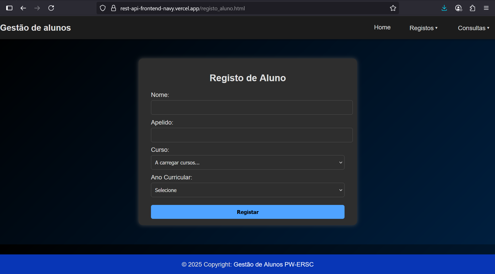
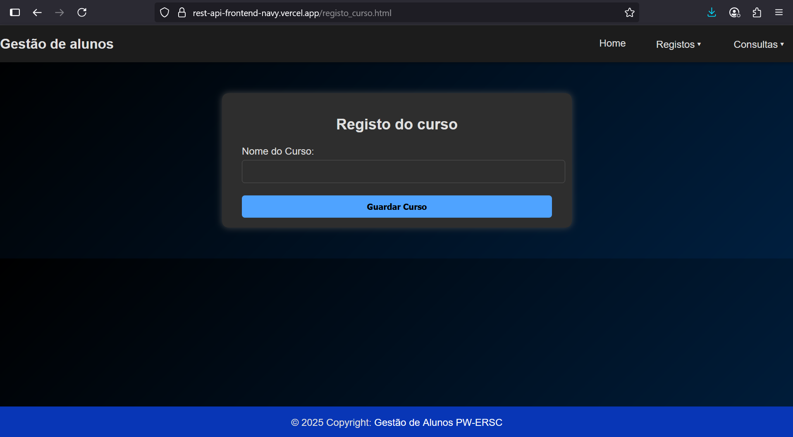
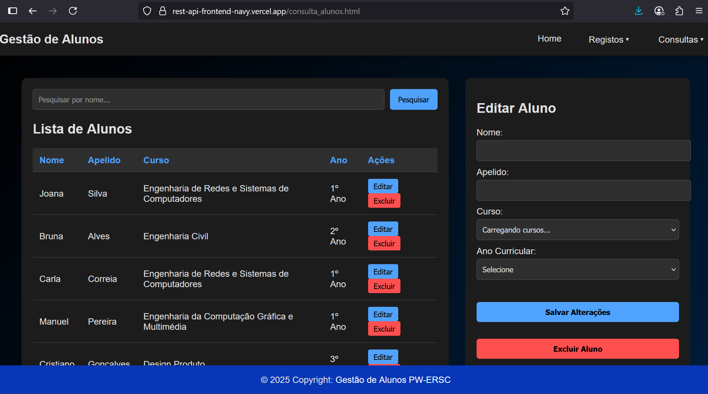
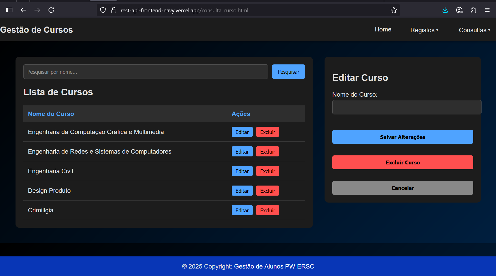

# 📚 Sistema de Gestão Escolar

**Aluno:** Hélito de Jesus Mendes de Horta 
**Número:** 32440 
**Curso:** Engenharia de Redes e Sistemas de Computadores  

Este projecto é uma plataforma para registo, e consulta de alunos e cursos.
---

## 🔍 Visão Geral da Interface
> Na página inicial é apresentado as opções de registo e consulta onde poderá fazer registo dos alunos e cursos e a consulta dos mesmos.

---
## 📝 Registo de cursos e alunos
 > Na secção registo poderá realizar o registo de alunos e dos cursos. Os cursos são carregados automaticamente ao entrar no site.

 

 
---
## 📖 Consulta e edição de alunos e cursos
> Na secção consulta, são apresentados os alunos e os cursos. Poderá também editar os alunos e cursos. 

---
🚀  Resumo de como utilizar:
 > Aceda ao frontend no navegador (ex: https://rest-api-frontend-navy.vercel.app).

    Para registar um curso, vá à secção Registo > Cursos.

    Para registar um aluno, vá à secção Registo > Alunos.

    Para consultar ou editar, vá à secção Consulta.
    ---
## 🛠️ Ferramentas utilizadas
- Node.js
- MongoDB
- HTML
- CSS
- JavaScript
- Vercel
- Render
---

## Recursos utilizados
- [mongoose]https://www.npmjs.com/package/mongoose
- [dotenv]https://www.npmjs.com/package/dotenv
- [cors]https://www.npmjs.com/package/cors
---
## URLs
- Frontend(vercel): https://rest-api-frontend-navy.vercel.app
- backend(render): https://trab1-restapi-h3lito.onrender.com

#### Atenção: Como o backend está em deploy gratuito e sofre de cold start (demora para iniciar após inatividade), entrando em hibernação após alguns minutos sem uso, optei por utilizar o Uptime Robot( https://uptimerobot.com/). Este serviço envia pings regulares ao backend a cada X minutos para mantê-lo ativo.
